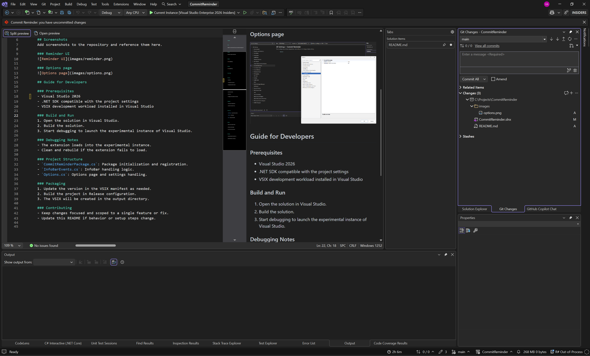

# CommitReminder

## About
CommitReminder is a Visual Studio extension that helps you keep a steady commit habit by reminding you when it has been a while since your last commit. It runs inside the IDE and surfaces a lightweight reminder so you can commit or note progress without leaving your workflow.

## Screenshots

### Reminder UI

### Options page

## Guide for Developers

### Prerequisites
- Visual Studio 2026
- .NET SDK compatible with the project settings
- VSIX development workload installed in Visual Studio

### Build and Run
1. Open the solution in Visual Studio.
2. Build the solution.
3. Start debugging to launch the experimental instance of Visual Studio.

### Debugging Notes
- The extension loads into the experimental instance.
- Clean and rebuild if the extension fails to load.

### Project Structure
- `CommitReminderPackage.cs`: Package initialization and registration.
- `InfoBarEvents.cs`: InfoBar handling logic.
- `Options.cs`: Options page and settings handling.

### Packaging
1. Update the version in the VSIX manifest as needed.
2. Build the project in Release configuration.
3. The VSIX will be created in the output directory.

### Contributing
- Keep changes focused and scoped to a single feature or fix.
- Update this README if behavior or setup steps change.

