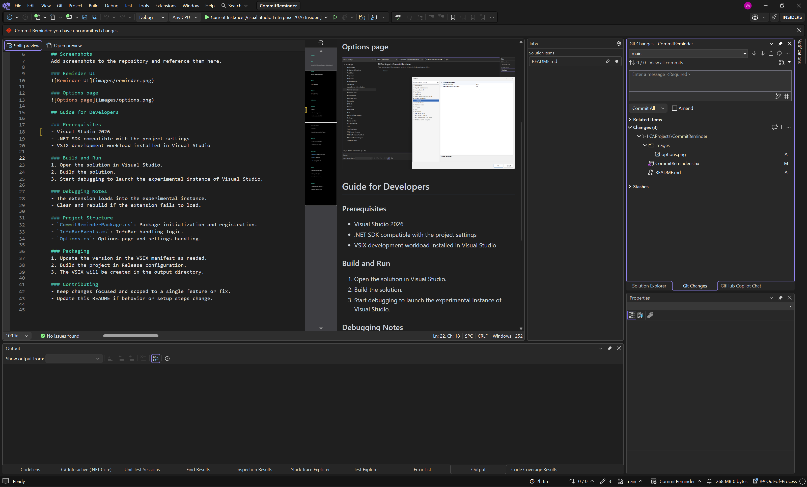
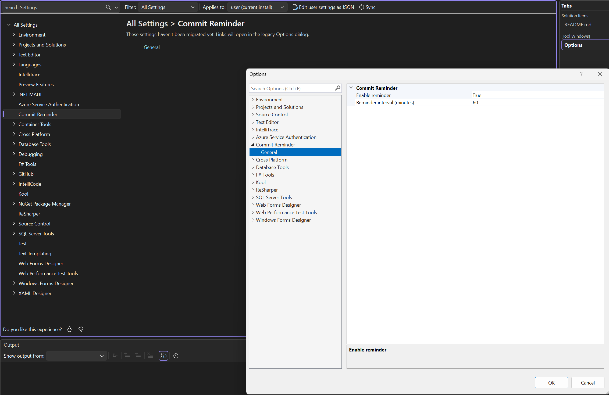

# CommitReminder

## About
CommitReminder is a Visual Studio extension that helps you keep a steady commit habit by reminding you when it has been a while since your last commit. It runs inside the IDE and surfaces a lightweight reminder so you can commit or note progress without leaving your workflow.

### Prerequisites
- Visual Studio 2026
- .NET SDK compatible with the project settings
- VSIX development workload installed in Visual Studio

## Release

[Download](CommitReminder.vsix)

## Screenshots

### Reminder UI

### Options page

